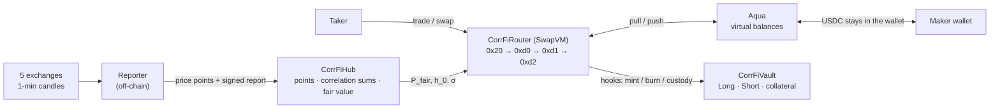
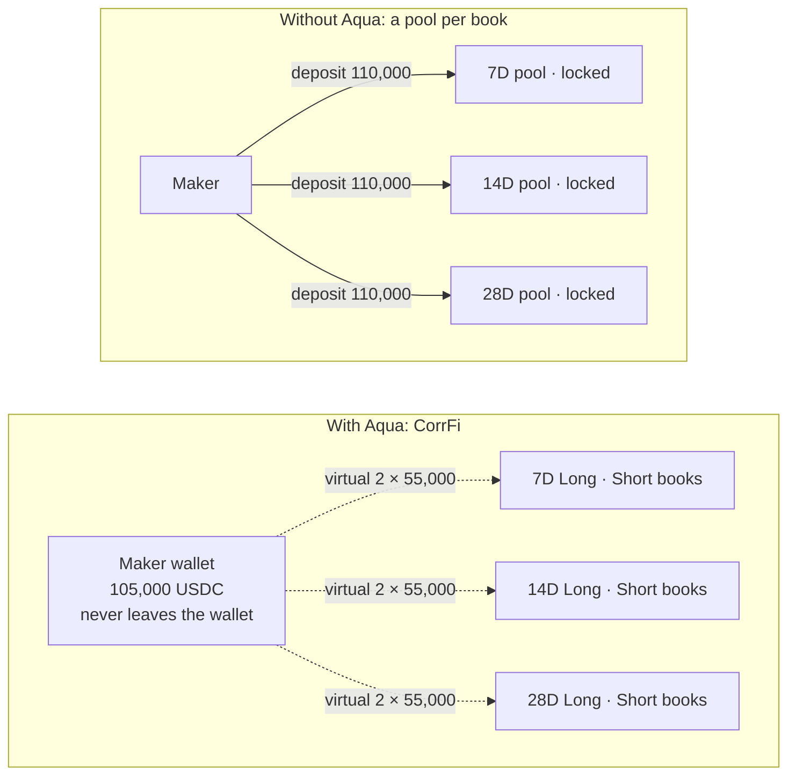
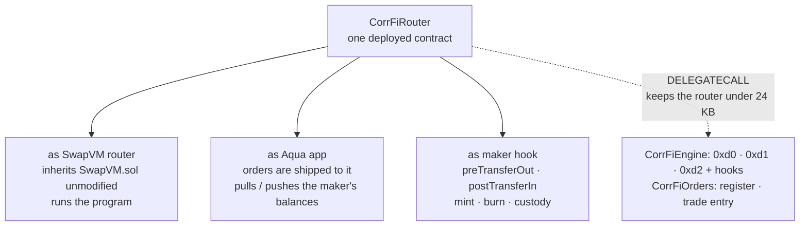
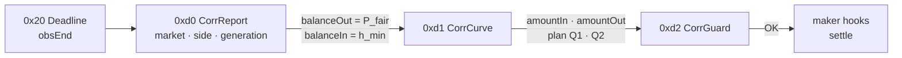
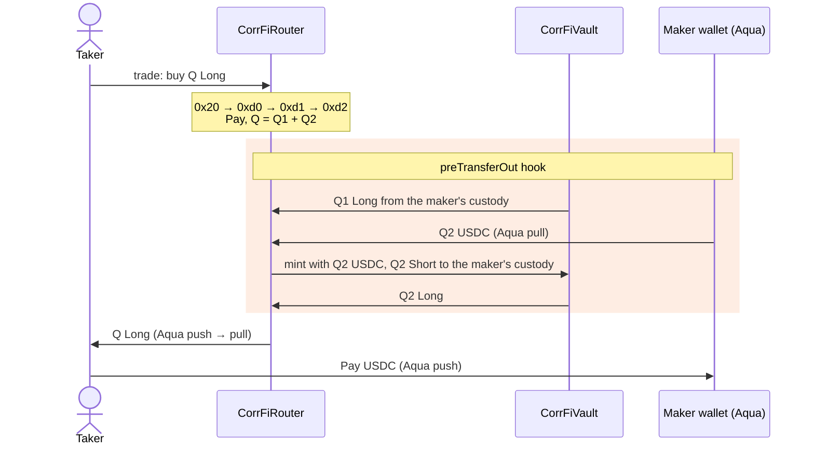
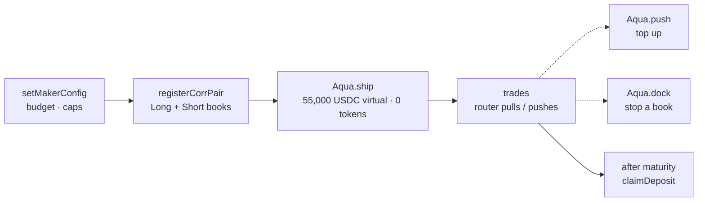

# CorrFi

I built **"CorrFi"** for ETHGlobal Tokyo 2026!!

This project is building DeFi protocol, which provides an exposure to a **"Correlation"** risk between multi asset.
You can take Long and Short views on future correlation.

## Table of contents
**0.For 1inch judges: where to look**
<br>**1.Problem**
<br>**2.Solution and overview**
<br>**3.How it works**
<br>**4.Aqua and SwapVM: why and how**
<br>**5.Deployments and on-chain proof**
<br>**6.Demo and try it**
<br>**7.Verification and tests**
<br>**8.What this does not claim**
<br>**9.Tech Stack**
<br>**10.License**

## 0.For 1inch judges: where to look

<!-- One row per 1inch prize requirement (official Aqua/SwapVM contracts, on-chain token transfers, commit history, sophisticated position, SwapVM usage) with links to the evidence: files, transactions, test commands. -->

## 1.Problem

### >>>>>Many crypto portfolios are exposed to the independent risk, Correlation risk.<<<<<

### Who is most exposed to this risk?
### ⇒Options / Volatility / Dispersion traders, Crypto Market Makers / Multi-asset trading firms, DeFi Treasury / Funds / Vaults

Crypto assets often experience sharp rises and falls. Then, most crypto assets tend to move in the same direction.
In other words, **correlations among crypto assets tend to increase!!!!!!** This is a major factor that makes crypto portfolios highly susceptible to directional momentum and volatility. Even if a portfolio is constructed using assets that appear to have low correlations with one another, those statistical relationships can break down during periods of strong momentum.
It is extremely difficult to hedge correlation risk using only existing on-chain financial products. Moreover, there are very few protocols that directly provide instruments for hedging correlation risk.


## 2.Solution and overview

CorrFi provides the direct way to hedge against Correlation.
With CorrFi, users can take long or short positions on future correlation. This enables them to directly hedge exposure to price correlation between assets during extreme market regimes in on-chain financial markets.

### Protocol overview

CorrFi is an MVP protocol for correlation derivatives based on the realized correlation between ETH and BTC. Users can mint Long and Short tokens using 1 USDC as collateral, with settlement determined by the realized correlation at maturity across three markets: 7, 14, and 28 days.

The protocol is built on 1inch Aqua, a liquidity layer that allows Makers to share their capital across multiple markets through virtual balances, and SwapVM, an execution framework that enables custom pricing logic to be expressed through dedicated opcodes. AquaCorr will be deployed on the Base Sepolia testnet.

Fair value is determined through a push-based mechanism in which an on-chain contract deterministically recomputes realized correlation from 5-minute VWAP log returns sourced from multiple exchanges. Makers do not participate in the price-calculation process; they are responsible only for providing liquidity and setting risk limits. Takers can call swap and quote functions without supplying any external data themselves.

An off-chain reporter bot submits price data every five minutes. However, an update is rejected unless the submitted values are consistent with the contract’s deterministic recomputation. In other words, while an external data source may attempt to provide false data, it cannot alter or falsify the calculation logic itself.

Risk-management controls, including inventory caps and circuit-breaker conditions, are also embedded directly into the protocol as invariants.

**This is an MVP built for ETHGlobal Tokyo 2026 and currently supports only BTC/ETH correlation. The broader goal, however, is to provide correlation markets across multiple asset pairs.**

## 3.How it works

Every five minutes a reporter posts ETH and BTC prices on-chain, and the hub turns them into the running correlation statistics and a **fair value** for each market. A trade is a SwapVM program run by the CorrFi router: three custom instructions read that fair value, price the trade along the maker's inventory, and check the risk limits; the maker hooks then move the tokens through Aqua. At maturity the realized correlation fixes what each token pays.



### 3.1 One trade, step by step

| Step | Instruction | What it does |
|---|---|---|
| 1 | `0x20` Deadline (standard SwapVM) | rejects an expired order |
| 2 | `0xd0` **CorrReport** | checks the market is trading (halts T-1…T-4, §3.7), reads $P_{\text{fair}}$ and $h_0$, adds the maker and staleness spreads → $h_{\min}$ (§3.4). Passes $P_{\text{fair}}$ and $h_{\min}$ to the next instruction in the SwapVM registers |
| 3 | `0xd1` **CorrCurve** | adds the utilization surcharge → $h$, prices the trade along the inventory path (§3.5), splits the quantity into inventory ($Q_1$) and new mint ($Q_2$) (§3.6) |
| 4 | `0xd2` **CorrGuard** | checks the post-trade inventory, utilization and the maker's funds (§3.7) |
| 5 | maker hooks `preTransferOut` / `postTransferIn` | mint or burn Long + Short pairs in the vault and move the tokens through Aqua (§3.6) |

The same program runs in the read-only `quote` and in the real `swap`, so a quote and its fill use identical math. Details of the instructions: [chapter 4](#4aqua-and-swapvm-why-and-how).

### 3.2 Price data

Every $\Delta = 300$ s (at $t_k = t_{\text{start}} + k\Delta$) the reporter takes, for ETH and for BTC, the volume-weighted average price of the 1-minute candle $[t_k - 60\,\text{s},\, t_k)$ on five exchanges (Binance, Bybit, OKX, KuCoin, Bitget) and posts the **median**:

$$
P_k = \mathrm{median}_{v \in \text{valid}}\, \mathrm{VWAP}_v\left([t_k - 60,\ t_k)\right) \qquad \text{(needs at least 3 valid venues, otherwise the bar is invalid)}
$$

The hub rejects a point whose log return is implausible, $|\ln(P_k/P_{k-1})| > 0.5$.

### 3.3 Settlement value (the realized correlation)

For each asset $i \in \{A, B\}$ (A = ETH, B = BTC) and each valid bar $k$, the log return is winsorized with a scale $s_i$ fixed when the market is created ($c = 4$):

$$
r_{i,k} = \ln\frac{P_{i,k}}{P_{i,k-1}}, \qquad \tilde r_{i,k} = \min\left(c\,s_i,\ \max\left(-c\,s_i,\ r_{i,k}\right)\right)
$$

The hub keeps the running sums on-chain:

$$
C = \sum_k \tilde r_{A,k}\,\tilde r_{B,k}, \qquad V_A = \sum_k \tilde r_{A,k}^2, \qquad V_B = \sum_k \tilde r_{B,k}^2
$$

At maturity ($N = 288 \times \text{tenor in days}$ bars) the realized correlation and the settlement value of Long are

$$
\rho_T = \frac{C}{\sqrt{V_A V_B}} \in [-1, 1], \qquad \mathrm{Long}_T = \frac{1 + \rho_T}{2} \in [0, 1]
$$

If fewer than $N_{\min} = \lceil 0.99N \rceil$ bars are valid, or a variance is zero, the market is **VOID** and $\mathrm{Long}_T = \tfrac12$. Anyone can call `finalize()` once the last bar is in. Holders redeem

$$
\mathrm{Payout} = \left\lfloor q_L \cdot \mathrm{Long}_T \right\rfloor + \left\lfloor q_S \cdot (1 - \mathrm{Long}_T) \right\rfloor \quad \text{USDC}
$$

so a Long + Short pair always pays 1 USDC — the collateral it was minted from.

### 3.4 Fair value before maturity

With $n_{\text{obs}}$ bars observed and $n_{\text{rem}} = N - n_{\text{obs}}$ remaining, the expected settlement fills the remaining bars with a per-bar covariance forecast $\hat\Sigma = \begin{pmatrix}\hat\sigma_A^2 & \hat\sigma_{AB} \\ \hat\sigma_{AB} & \hat\sigma_B^2\end{pmatrix}$:

$$
\hat\rho_T = \frac{C + n_{\text{rem}}\,\hat\sigma_{AB}}{\sqrt{\left(V_A + n_{\text{rem}}\,\hat\sigma_A^2\right)\left(V_B + n_{\text{rem}}\,\hat\sigma_B^2\right)}}, \qquad P_{\text{fair}} = \frac{1 + \hat\rho_T}{2}
$$

$\hat\Sigma$ is fixed at creation from data before the start only: $\hat\Sigma = w\,\hat\Sigma_{\text{long}} + (1 - w)\,\hat\Sigma_{\text{recent}}$ (90-day and recent 5-minute covariances; $w = 0.3 / 0.5 / 0.6$ for 7D / 14D / 28D). At the start $P_{\text{fair}}$ is a classic correlation forecast; as bars accumulate it converges to the realized value.

**Trustless update.** With each report the reporter signs $(k, P_{\text{fair}}, h_0)$; the hub recomputes both from its own sums and **rejects the report unless they match exactly**. The reporter can feed prices but cannot change the math. The price engine (TypeScript), the contracts (Solidity) and the verifier (Python) share one fixed-point specification and agree to the bit.

### 3.5 Spread: base spread and risk surcharges

The half-spread has a floor $h_{\min}$ and a utilization surcharge on top:

$$
h_{\min} = h_0 + h_M + h_O, \qquad h = h_{\min} + h_U(U^{*})
$$

| Term | Formula | Meaning |
|---|---|---|
| Base spread $h_0$ | $h_0 = \max\left(h_{\text{floor}},\ c_h\,\sigma_P(\tau)\right)$, $\ \tau = n_{\text{obs}}/N$ | forecast uncertainty: $\sigma_P(\tau)$ is a backtested error table that falls to 0 at maturity |
| Maker spread $h_M$ | set by the maker | optional extra margin (0 in the MVP) |
| Staleness $h_O$ | $h_O = c_O\,\bar\sigma\,\sqrt{\text{age}/\Delta}$ | risk that the fair value moved since the last report; $\text{age} = \text{now} - t_{\text{ref}}$ |
| Utilization $h_U$ | $h_U = h_{U,\max}\,x^2$, $\ x = \dfrac{U^{*} - U_0}{U_{\max} - U_0}$ for $U^{*} > U_0$, else 0 | the maker's capital filling up ($U^{*}$ = utilization before the trade) |

$\bar\sigma$ is the typical move of $P_{\text{fair}}$ per bar, an EMA updated with each report that advanced $\Delta k$ bars and moved the fair value by $\Delta P$:

$$
\bar\sigma^2 \leftarrow \lambda\,\bar\sigma^2 + (1 - \lambda)\,\frac{(\Delta P)^2}{\Delta k}, \qquad \lambda = 2^{-1/72}
$$

Utilization counts the risk capital of the maker's inventory in every market ($q_m$ = Long-equivalent inventory, §3.6):

$$
RC_m = \begin{cases} q_m\,P_{\text{fair},m} & q_m > 0 \\ |q_m|\,(1 - P_{\text{fair},m}) & q_m < 0 \end{cases}, \qquad U = \frac{\sum_m RC_m}{\text{RiskBudget}}
$$

### 3.6 Bid, ask and execution price

Let $q = N_L - N_S$ be the maker's inventory in Long-equivalent tokens (its Long minus Short custody in the vault). The maker's **ask for Long** $\alpha(q)$ and **bid for Long** $\beta(q)$ lean against the inventory with slope $k_q$ over the market cap $q_{\max}$:

$$
\alpha(q) = \min\left(1,\ \max\left(P_{\text{fair}} + h_{\min},\ P_{\text{fair}} + h - k_q\frac{q}{q_{\max}}\right)\right)
$$

$$
\beta(q) = \max\left(0,\ \min\left(P_{\text{fair}} - h_{\min},\ P_{\text{fair}} - h - k_q\frac{q}{q_{\max}}\right)\right)
$$

Short is the other side of the same book: its ask is $1 - \beta$ and its bid $1 - \alpha$. A trade of $Q$ tokens moves the inventory from $q_0$ and is priced as the **integral along that path**, rounded in the maker's favor:

| Direction | Inventory | Taker pays / receives (USDC) |
|---|---|---|
| D1 buy Long | $q_0 \to q_0 - Q$ | $\text{Pay} = \left\lceil \int_{q_0 - Q}^{q_0} \alpha(q)\,dq \right\rceil$ |
| D2 sell Long | $q_0 \to q_0 + Q$ | $\text{Receive} = \left\lfloor \int_{q_0}^{q_0 + Q} \beta(q)\,dq \right\rfloor$ |
| D3 buy Short | $q_0 \to q_0 + Q$ | $\text{Pay} = Q - \left\lfloor \int_{q_0}^{q_0 + Q} \beta(q)\,dq \right\rfloor$ |
| D4 sell Short | $q_0 \to q_0 - Q$ | $\text{Receive} = Q - \left\lceil \int_{q_0 - Q}^{q_0} \alpha(q)\,dq \right\rceil$ |

A larger trade walks further along the curve, so size costs come from $k_q$ alone. For an amount given in USDC (exact-in buys, exact-out sells) the router solves the integral for $Q$ in closed form. The average price is $\text{Pay}/Q$ (or $\text{Receive}/Q$); the deviation from $P_{\text{fair}}$ splits into the minimum spread, the utilization surcharge and the inventory slope, as shown on the trade page.

**Where the tokens come from.** The maker never pre-mints. For a buy, $Q_1 = \min(Q, \text{custody})$ comes from the maker's custody in the vault and $Q_2 = Q - Q_1$ is **minted in the same transaction**: the hook pulls $Q_2$ USDC from the maker's wallet through Aqua and mints $Q_2$ Long + $Q_2$ Short (1 USDC each pair), keeping the other side in custody. For a sell, tokens that pair with the maker's opposite custody are **burned back into USDC** and pushed to the maker's Aqua balance; the rest is bought into custody.

### 3.7 Risk limits and halts

`0xd2` CorrGuard accepts a trade only if, after it:

- $Q_{\min} \le Q \le Q_{\max}$;
- a fill that increases $|q_m|$ keeps $|q_m| \le q_{\max}$ and $\sum_m |q_m| \le q_{\text{grp}}$;
- a fill that increases $RC_m$ keeps $U < U_{\max}$;
- the order's Aqua allocation, the maker's wallet balance and its approvals cover the USDC and tokens the fill moves.

`0xd0` CorrReport halts trading while any of these fails:

| | Condition to trade |
|---|---|
| T-1 sync | every accumulated bar has a confirmed report |
| T-2 freshness | $\text{age} \le \Delta + g$ |
| T-3 expiry | $\text{now} < \text{obsEnd}$ |
| T-4 data quality | invalid bars $\le (N - N_{\min})/2$ |

T-1 and T-2 clear themselves with the next report; T-4 is permanent (the market will settle VOID).

### 3.8 Parameters

| Symbol | Value | | Symbol | Value |
|---|---|---|---|---|
| $\Delta$ | 300 s | | $c_h$, $h_{\text{floor}}$ | 0.30, 0.005 |
| $N$ | 2,016 / 4,032 / 8,064 | | $c_O$, $g$ | 1.5, 60 s |
| $N_{\min}$ | $\lceil 0.99N \rceil$ | | $h_{U,\max}$, $U_0$, $U_{\max}$ | 0.02, 0.6, 0.9 |
| $c$ (winsorize) | 4 | | $k_q$ | 1/6 |
| $w$ | 0.3 / 0.5 / 0.6 | | $q_{\max}$, $q_{\text{grp}}$ | 50,000, 100,000 tokens |
| $\lambda$ | $2^{-1/72}$ | | $Q_{\min}$, $Q_{\max}$ | 1, 5,000 tokens |
| | | | RiskBudget | 100,000 USDC |

Code: [`CorrFiMath.sol`](contracts/src/lib/CorrFiMath.sol) (returns, correlation, fair value, spreads), [`CorrFiCurve.sol`](contracts/src/lib/CorrFiCurve.sol) (bid/ask curves and path integrals), [`CorrFiPricing.sol`](contracts/src/lib/CorrFiPricing.sol) (spread assembly, inventory split, risk limits), [`CorrFiHub.sol`](contracts/src/CorrFiHub.sol) (price points, sums, report check), [`CorrFiEngine.sol`](contracts/src/lib/CorrFiEngine.sol) (the three instructions and the hooks).

## 4.Aqua and SwapVM: why and how

### Why Aqua and SwapVM

**Aqua — one wallet backs every book.** A maker quotes 3 markets × Long / Short = 6 books, each able to fill up to 55,000 USDC.



| | Without Aqua | With Aqua (CorrFi) |
|---|---|---|
| USDC committed for 6 books | 330,000, locked in pools | **105,000**, stays in the wallet |
| Long / Short inventory | minted in advance | minted inside the trade that needs it |
| Risk across books | each pool on its own | one budget: $\sum RC < 0.9 \times$ RiskBudget |

**SwapVM — the price is a program, not a pool ratio.**

| The market needs | Constant-product AMM | CorrFi on SwapVM |
|---|---|---|
| Price anchor | pool ratio $x \cdot y = k$ | on-chain fair value — `0xd0` |
| Spread | fixed fee | $h_0 + h_M + h_O + h_U$, moves with time, staleness, risk — `0xd0` `0xd1` |
| Size cost | pool depth | inventory slope $k_q$, path integral — `0xd1` |
| Risk limits | none | inventory caps, $U_{\max}$, maker funds — `0xd2` |
| Inventory | deposited in advance | minted / burned in the swap — maker hooks |

### How we use them

**One contract, three roles.**



**The program — 19 bytes, the only one the router accepts.**



| Opcode | Args | Reads | Writes | Code |
|---|---|---|---|---|
| `0x20` Deadline | `obsEnd` (5 B) | block time | — | SwapVM [`Controls.sol`](https://github.com/1inch/swap-vm/blob/feb16411738331f7d05ae71d4a664154068018fc/contracts/instructions/Controls.sol) |
| `0xd0` CorrReport | market, side, generation (6 B) | hub: $P_{\text{fair}}$, $h_0$, $\bar\sigma$, report age | `balanceOut` ← $P_{\text{fair}}$, `balanceIn` ← $h_{\min}$, maker lock | [`CorrFiEngine.report`](contracts/src/lib/CorrFiEngine.sol) |
| `0xd1` CorrCurve | — | custody $N_L, N_S$, utilization $U^{*}$ | `amountIn`, `amountOut`, plan $Q_1, Q_2$, `CorrSwap` event | [`CorrFiEngine.curve`](contracts/src/lib/CorrFiEngine.sol) |
| `0xd2` CorrGuard | — | post-trade $q$, $U$, maker funds | — (reverts if a limit fails) | [`CorrFiEngine.guard`](contracts/src/lib/CorrFiEngine.sol) |

The lock and the plan live in transient storage and are cleared by the hooks. `quote` runs the same bytes read-only.

**A buy, token by token** (D1: buy $Q$ Long).



| | Hook | Tokens |
|---|---|---|
| Buy (D1, D3) | `preTransferOut` | $Q_1$ from custody + $Q_2$ minted with USDC pulled from the book; the other side of $Q_2$ goes to custody |
| Sell (D2, D4) | `postTransferIn` | $Q_1$ burned with the maker's opposite custody, USDC pushed back to the book; $Q_2$ kept in custody |

**The maker's side.**



**Versions.**

| | Pinned | Modified? |
|---|---|---|
| Aqua | v1.0.0 ([`81c26e4`](https://github.com/1inch/aqua/tree/81c26e4619ce21556ab02b3284ee2685de21fb18)) | No — deployed as is |
| SwapVM | [`feb1641`](https://github.com/1inch/swap-vm/tree/feb16411738331f7d05ae71d4a664154068018fc) | `SwapVM.sol` no; `CorrFiRouter` inherits it and adds `0xd0`–`0xd2` and the hooks (SwapVM-1.1 license) |

## 5.Deployments and on-chain proof

**Network:** Base Sepolia (chain ID 84532) · deployed at block [47,323,906](https://sepolia.basescan.org/block/47323906) on 2026-09-26 · explorer: [BaseScan](https://sepolia.basescan.org)

**Reproducible bytecode.** The creation code of every deployment transaction and the runtime code on chain match the pinned build [`contracts/build-manifest.json`](contracts/build-manifest.json) (compiler, settings and dependency commits). Check it yourself:

```sh
cd engine
node scripts/build_manifest.ts --broadcast ../deployments/base-sepolia.broadcast.json
RPC_URL=https://sepolia.base.org node scripts/build_manifest.ts --deployed ../deployments/base-sepolia.json
```

Source verification on BaseScan has not been submitted yet.

**Contracts**

| Contract | Role | Address | Deployed in |
|---|---|---|---|
| Aqua | 1inch Aqua v1.0.0 ([`81c26e4`](https://github.com/1inch/aqua/tree/81c26e4619ce21556ab02b3284ee2685de21fb18)), unmodified | [`0xfd7d2a5B777b3424eDC41682eA3f93138fCd6B27`](https://sepolia.basescan.org/address/0xfd7d2a5B777b3424eDC41682eA3f93138fCd6B27) | [`0x867d…40bb`](https://sepolia.basescan.org/tx/0x867d8bfd901bcf1c0fdde7752ab47927d56803f9bc403f4ebef20cd789ff40bb) |
| CorrFiRouter | SwapVM router (inherits `SwapVM.sol` unmodified), Aqua app, maker hooks | [`0x312f064abE74faeC34762C96b100E2CC22b451c1`](https://sepolia.basescan.org/address/0x312f064abE74faeC34762C96b100E2CC22b451c1) | [`0xea63…45c2`](https://sepolia.basescan.org/tx/0xea63b764d5165e6a8aedcc4dece4aced649a16000371f70a93739885f04e45c2) |
| CorrFiEngine | library: opcodes `0xd0`–`0xd2` and hooks (CREATE2) | [`0xFF00299DC1aB900116d1d5b80e9D7871D2987b8A`](https://sepolia.basescan.org/address/0xFF00299DC1aB900116d1d5b80e9D7871D2987b8A) | [`0x73ed…1ba5`](https://sepolia.basescan.org/tx/0x73edb18e9df3b98b4f2bc2d27629d38286b271cdcef0d2b7ade80447029a1ba5) |
| CorrFiOrders | library: order registry and trade entry (CREATE2) | [`0x993d625Dbf20FC0e4B4D4BF7f8cd4e53f1d40dc4`](https://sepolia.basescan.org/address/0x993d625Dbf20FC0e4B4D4BF7f8cd4e53f1d40dc4) | [`0xc6fe…af9d`](https://sepolia.basescan.org/tx/0xc6fe182539b681a503b815e8091d4014e59646210e7fc5c0c952ed72fcc2af9d) |
| CorrFiHub | price points, signed reports, fair value, market factory | [`0x2d6B16B388729a97c09616e112C1409170191f45`](https://sepolia.basescan.org/address/0x2d6B16B388729a97c09616e112C1409170191f45) | [`0x8c81…08b1`](https://sepolia.basescan.org/tx/0x8c816813f7b62ec695de8afb96c347711c4ff3bf478040de0868c6b1deec08b1) |
| CorrFiLens | quote breakdown (same code path as the swap) | [`0x9d028c604C705DA487C4124934BeD0B140182B8b`](https://sepolia.basescan.org/address/0x9d028c604C705DA487C4124934BeD0B140182B8b) | [`0x08dc…cc09`](https://sepolia.basescan.org/tx/0x08dcb4c257d0544fa5cf6447eef3fb2d6c93c7ec96e92722cbee000ce6efcc09) |
| tUSDC | Test USDC (6 decimals, no value): owner mint, public faucet 10,000 / wallet / 24 h | [`0x3D39e3b30261FD59D93bDdD24C09C419b3dF8631`](https://sepolia.basescan.org/address/0x3D39e3b30261FD59D93bDdD24C09C419b3dF8631) | [`0x8173…1b3e`](https://sepolia.basescan.org/tx/0x81732f5093066debfd0a354e8c14d4f3aa3789269f965b0d9d9d154429711b3e) |
| CorrFiVault (implementation) | per-market vault, EIP-1167 clones (created by the hub) | [`0x5F08322F62Beb1af22071D1B73b98a1ada7750EC`](https://sepolia.basescan.org/address/0x5F08322F62Beb1af22071D1B73b98a1ada7750EC) | with the hub |
| CorrFiToken (implementation) | Long / Short ERC-20, EIP-1167 clones (created by the hub) | [`0x77EcC8fa4f44Ae096Cf9b6E70A2120Fdca2Dd5A5`](https://sepolia.basescan.org/address/0x77EcC8fa4f44Ae096Cf9b6E70A2120Fdca2Dd5A5) | with the hub |

Used as deployed on Base Sepolia: Multicall3 [`0xcA11bde05977b3631167028862bE2a173976CA11`](https://sepolia.basescan.org/address/0xcA11bde05977b3631167028862bE2a173976CA11), WETH [`0x4200000000000000000000000000000000000006`](https://sepolia.basescan.org/address/0x4200000000000000000000000000000000000006).

**Markets** (ETH / BTC, observation from 2026-09-26 10:00 UTC; maturity at 10:00 UTC)

| Market | Vault | Long (ETHBTC-L) | Short (ETHBTC-S) | Maturity | Created in |
|---|---|---|---|---|---|
| 7D #0 | [`0x19E985710067694A28252cD5D40a9a47e8c1201C`](https://sepolia.basescan.org/address/0x19E985710067694A28252cD5D40a9a47e8c1201C) | [`0x09d5245828C1CC8fB1Ae0Ae0398A6be73A4CC278`](https://sepolia.basescan.org/address/0x09d5245828C1CC8fB1Ae0Ae0398A6be73A4CC278) | [`0xc3Dd47B4088A8C2Ab457fb353839423e634aAd1d`](https://sepolia.basescan.org/address/0xc3Dd47B4088A8C2Ab457fb353839423e634aAd1d) | 2026-10-03 | [`0x0c4a…f3f6`](https://sepolia.basescan.org/tx/0x0c4a47bb55d6d87ecf2738d796c6c7b9141fa8617043a44faec805392bcbf3f6) |
| 14D #1 | [`0x9a9dd9AA38ff8D4BF27Fbaf314C0Ea3fe58352A4`](https://sepolia.basescan.org/address/0x9a9dd9AA38ff8D4BF27Fbaf314C0Ea3fe58352A4) | [`0x193DE4A272BEa27B1852284b74Cdf8e285f30115`](https://sepolia.basescan.org/address/0x193DE4A272BEa27B1852284b74Cdf8e285f30115) | [`0x4C53cB023eE33b0D4A680833b00a9b76414B33e8`](https://sepolia.basescan.org/address/0x4C53cB023eE33b0D4A680833b00a9b76414B33e8) | 2026-10-10 | [`0x2669…0a64`](https://sepolia.basescan.org/tx/0x2669a0d87cb3021b4a09adc55a25846592fafc57869aac3619912023f0f20a64) |
| 28D #2 | [`0x34970193B4c51c955b8e9dF610017F420Bb00640`](https://sepolia.basescan.org/address/0x34970193B4c51c955b8e9dF610017F420Bb00640) | [`0x48080c152116B9c61478805070Ec3d2A1D0AcF8c`](https://sepolia.basescan.org/address/0x48080c152116B9c61478805070Ec3d2A1D0AcF8c) | [`0x37166040D9C5b697808aA9620640b7fD8D942A72`](https://sepolia.basescan.org/address/0x37166040D9C5b697808aA9620640b7fD8D942A72) | 2026-10-24 | [`0xe2f6…f089`](https://sepolia.basescan.org/tx/0xe2f67d74f032341469c5cd12fa93b7099bbcd9a4ae02ff9beceffad5d9bef089) |

**Accounts** (test keys generated for this testnet deployment; never used anywhere else)

| Role | Address |
|---|---|
| Deployer (owner, treasury, tUSDC owner) | [`0xd688EF28D1B26337677aE59742C057DC68Ad8EA6`](https://sepolia.basescan.org/address/0xd688EF28D1B26337677aE59742C057DC68Ad8EA6) |
| Reporter (posts price points and reports every 5 minutes) | [`0xcd81C7339525abD11bcF66eB28f69F0C168A70D7`](https://sepolia.basescan.org/address/0xcd81C7339525abD11bcF66eB28f69F0C168A70D7) |
| Price engine (EIP-712 signer of the reports) | [`0x6B6F779E4dfCA1FA9E6FFfe90d2aC77B1553CD88`](https://sepolia.basescan.org/address/0x6B6F779E4dfCA1FA9E6FFfe90d2aC77B1553CD88) |
| Maker (the default maker, 1,000,000 tUSDC) | [`0x4fefEAd860DF1a2E176F43081E07FA2079D0A153`](https://sepolia.basescan.org/address/0x4fefEAd860DF1a2E176F43081E07FA2079D0A153) |
| Taker (demo) | [`0x494916F5054722CC7e4666Eecb67AeB5A14e87a1`](https://sepolia.basescan.org/address/0x494916F5054722CC7e4666Eecb67AeB5A14e87a1) |

**On-chain proof**

| What | Transactions |
|---|---|
| Router registered in the hub (`setRouter`) | [`0xb458…d0be`](https://sepolia.basescan.org/tx/0xb4587fa366be73faf3ad62dbe9a8971be42e7c508f3122a4bbb123fc9490d0be) |
| Markets created, each with the price engine's signed initial report (7D · 14D · 28D) | [`0x0c4a…f3f6`](https://sepolia.basescan.org/tx/0x0c4a47bb55d6d87ecf2738d796c6c7b9141fa8617043a44faec805392bcbf3f6) · [`0x2669…0a64`](https://sepolia.basescan.org/tx/0x2669a0d87cb3021b4a09adc55a25846592fafc57869aac3619912023f0f20a64) · [`0xe2f6…f089`](https://sepolia.basescan.org/tx/0xe2f67d74f032341469c5cd12fa93b7099bbcd9a4ae02ff9beceffad5d9bef089) |
| The maker's Long + Short books registered on the router (`registerCorrPair`) | [`0x3821…30ef`](https://sepolia.basescan.org/tx/0x3821f29e2496942e7be305a3cc1a248cdcb58359a4a8f45ef2e56be9322e30ef) · [`0x1062…286c`](https://sepolia.basescan.org/tx/0x1062a6f5205191e78c4aad3395350983d11d615ed5330b686efbb0546b00286c) · [`0xde39…b596`](https://sepolia.basescan.org/tx/0xde39ca1134963959285bf4abc276f22a8364c0a5fb4e443c62c05aaa0917b596) |
| Six books shipped to Aqua, 55,000 tUSDC virtual each, one approval for all (`Aqua.ship`) | [`0xcb1b…fc0c`](https://sepolia.basescan.org/tx/0xcb1b3488539bc6357acc26977e0adb2157ebb783a245ec9f69177422ce0afc0c) · [`0xe88c…72a5`](https://sepolia.basescan.org/tx/0xe88c675a2d9324dee0ef9840b19893ddd1afa369d6a9a117d2facffb5bd672a5) · [`0x99a2…5e9a`](https://sepolia.basescan.org/tx/0x99a2dfe7e5e8983cf464ad8e6cb9f7f536c6e4e269dc34c337f49a998e8e5e9a) · [`0xda6d…3494`](https://sepolia.basescan.org/tx/0xda6d921dca4f89edac94100fbefa99ecec33b364693aba553289462b74883494) · [`0xce56…9720`](https://sepolia.basescan.org/tx/0xce5663b917f5d0e62cd96546a62403b79cb94221fdb5fe98e61e52a281ba9720) · [`0x9e55…4ed2`](https://sepolia.basescan.org/tx/0x9e5566fb56b74366731742a91d18c2ed7ef96622baeee1d6701a2b77e3004ed2) |
| First fair-value report accepted by the hub's on-chain recomputation (`postAndReport`, all three markets) | [`0x1a1c…dc07`](https://sepolia.basescan.org/tx/0x1a1c8a5b5bbfa17b384e4d7000cd1f61f32d95c5d076af53ac81de6372a4dc07) |
| Swaps in the four directions, a mint in the hook, finalize, redeem | to be added (after the demo; finalize and redeem at maturity) |

## 6.Demo and try it

<!-- Demo video and live site. Try it: get tUSDC on the faucet page -> trade Long / Short on the trade page -> redeem after maturity. Run it locally: cd ui && npm run live; the 7D replay demo. -->

## 7.Verification and tests

<!-- Invariants (quote = breakdown = swap; collateral = supply; Solidity / TypeScript / Python fixed-point results identical to the bit; the replay's V1-V8 checks and deterministic final state) and a table: suite -> what it proves -> count -> command. Backtest in 2-3 lines: B1 pass and the adopted parameters. -->

## 8.What this does not claim

<!-- Testnet only; SwapVM main is unaudited; the reporter is trusted for the price points (the contract enforces the math); tUSDC is a test token; the gold pairs are not listed yet. -->

## 9.Tech Stack

| Layer | Stack |
|---|---|
| Smart contracts | Solidity 0.8.30 (via-IR, optimizer 700 runs, EVM Cancun) · Foundry v1.8.3 (forge, anvil, cast) |
| 1inch | SwapVM [`feb1641`](https://github.com/1inch/swap-vm/tree/feb16411738331f7d05ae71d4a664154068018fc) (router base, `Deadline` opcode) · Aqua v1.0.0 [`81c26e4`](https://github.com/1inch/aqua/tree/81c26e4619ce21556ab02b3284ee2685de21fb18) · 1inch solidity-utils |
| Contract libraries | OpenZeppelin Contracts v5.4.0 · Solady v0.1.26 (`lnWad`) · forge-std v1.11.0 |
| Off-chain engine | TypeScript on Node.js 24 (run directly, no build step) · viem 2.56.9 — reporter, price engine (EIP-712 signed reports), finalizer, maker tools, replay driver |
| Frontend | Vite 7.3.6 · TypeScript 5.9.3 · plain DOM (no framework) · viem · MetaMask (EIP-1193 connect and chain switch, EIP-747 add token) |
| Verifier and research | Python 3.13 · mpmath 1.3.0 (50-digit reference) · NumPy · pytest · pure-Python Keccak-256 |
| Market data | 1-minute klines from Binance, OKX, Bybit, Bitget and KuCoin (public REST APIs) |
| Network | Base Sepolia (OP Stack) · Multicall3 · BaseScan |
| Tests and CI | Foundry unit, fuzz and invariant tests · node:test · pytest · Playwright · GitHub Actions |

## 10.License

| Part | License |
|---|---|
| CorrFi code derived from SwapVM: [`CorrFiRouter`](contracts/src/CorrFiRouter.sol), [`CorrFiEngine`](contracts/src/lib/CorrFiEngine.sol), [`CorrFiOrders`](contracts/src/lib/CorrFiOrders.sol), [`CorrFiLens`](contracts/src/CorrFiLens.sol) | `LicenseRef-Degensoft-SwapVM-1.1` — published under the same license with the complete corresponding source (SwapVM-1.1 §3.1 A); changes and their date are marked in the file headers (§3.1 D) |
| All other CorrFi code (hub, vault, tokens, math and curve libraries, engine, UI, verifier, data and backtest tools) | [MIT](LICENSE) |
| 1inch SwapVM | `LicenseRef-Degensoft-SwapVM-1.1` © Degensoft Ltd 2025 ([`LICENSES/SwapVM-1.1.txt`](https://github.com/1inch/swap-vm/tree/feb16411738331f7d05ae71d4a664154068018fc)) |
| 1inch Aqua | `LicenseRef-Degensoft-Aqua-Source-1.1` © Degensoft Ltd 2025 ([`LICENSES/Aqua-Source-1.1.txt`](https://github.com/1inch/aqua/tree/81c26e4619ce21556ab02b3284ee2685de21fb18)) |
| OpenZeppelin Contracts · Solady · 1inch solidity-utils | MIT |
| forge-std | MIT / Apache-2.0 |

Some Solidity files under `contracts/src` still read `SPDX-License-Identifier: UNLICENSED`. They are MIT like the rest: the identifiers are left as deployed because the Base Sepolia bytecode embeds a hash of these exact source files (changing a comment would break the reproducible-bytecode check in section 5). They will be updated with the next deployment.

Powered by SwapVM — © Degensoft Ltd 2025. Powered by Aqua — © Degensoft Ltd 2025. The same notices are shown in the UI. CorrFi uses the SwapVM and Aqua names only to state its integration; it is not affiliated with 1inch or Degensoft.

Build and deployment (SwapVM-1.1 §3.1 E): `cd contracts && forge build`, then `ENV_FILE=<keys file> DEPLOY_NAME=base-sepolia engine/scripts/testnet.sh deploy` (checks the build against `contracts/build-manifest.json` before sending), `verify`, `calib`, `markets`, `maker`, `bots`.

---

Powered by SwapVM — © Degensoft Ltd 2025 · Aqua — © Degensoft Ltd 2025. CorrFi is not affiliated with 1inch or Degensoft.
